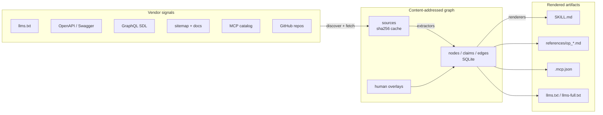

# skillship

> Generate and maintain Claude skills from a SaaS vendor's own API signals.

[](https://github.com/firmislabs/skillship/actions/workflows/ci.yml)
[](LICENSE)
[](.nvmrc)
[](https://github.com/firmislabs/skillship/stargazers)
[](CONTRIBUTING.md)

Point it at a domain + GitHub org. It ingests `llms.txt`, OpenAPI, GraphQL
SDL, MCP catalogs, docs, and sitemaps into a content-addressed graph, then
renders `SKILL.md`, per-op references, `.mcp.json`, and `llms.txt` — with
per-claim provenance. Re-runs produce a git diff you can review as a PR.

OSS, MIT, no telemetry, no hosted service. Your API key, your machine.

## Quick start

Run without cloning — npx installs straight from GitHub:

```bash
npx github:firmislabs/skillship init --domain https://supabase.com --github supabase
npx github:firmislabs/skillship build --in . --out skills

ls skills/supabase-com/
# SKILL.md  references/  .mcp.json  llms.txt  llms-full.txt
```

Commit `skills/` to your repo — it's what Claude consumes.

## Demo

A full run against Supabase's public API:

```console
$ npx github:firmislabs/skillship init --domain https://supabase.com --github supabase
skillship init: wrote .skillship/config.yaml (11 sources, coverage=gold)

$ npx github:firmislabs/skillship build --in . --out skills
skillship build: wrote 281 artifacts to skills
  - skills/supabase-com/SKILL.md
  - skills/supabase-com/.mcp.json
  - skills/supabase-com/llms.txt
  - skills/supabase-com/llms-full.txt
  - skills/supabase-com/manifest.json
  - skills/supabase-com/references/op_*.md  (276 files)
```

A typical generated operation reference:

```markdown
# POST /v1/branches/{branch_id_or_ref}/push

**Pushes a database branch**

## Parameters
| name | in | required | type |
|------|----|----------|------|
| branch_id_or_ref | path | yes | string |

## Responses
| status | content-type | schema |
|--------|-------------|--------|
| 201 | application/json | BranchUpdateResponse |

## Authentication
- bearer
```

Every field traces back to the source byte offset it came from; conflicts
between sources surface as `conflicted` claims, not silent drops.

<details>
<summary><strong>Install globally (skip npx on every call)</strong></summary>

```bash
npm install -g github:firmislabs/skillship
skillship init --domain https://supabase.com --github supabase
skillship build --in . --out skills
```
</details>

<details>
<summary><strong>Fork and run from source (to contribute)</strong></summary>

```bash
# 1. Click "Fork" on GitHub, then clone your fork:
git clone https://github.com/YOUR_USERNAME/skillship.git
cd skillship

# 2. Use pinned Node, install, build, link:
nvm use            # Node 20 from .nvmrc
npm install        # auto-builds via `prepare` script
npm link           # exposes `skillship` from your local build
npm test           # 359 tests should pass

# 3. Try it:
skillship init --domain https://supabase.com --github supabase
```

See [CONTRIBUTING.md](CONTRIBUTING.md) for the full dev loop and PR
conventions.
</details>

<details>
<summary><strong>Use with different vendors</strong></summary>

Works today against vendors that publish a machine-readable API surface —
OpenAPI 3, Swagger 2, or GraphQL SDL. Our eval set covers stripe, supabase,
vercel, linear, gitea, posthog, anthropic, n8n, directus.

```bash
# GraphQL-first (Linear)
skillship init --domain https://linear.app --github linear

# REST + OpenAPI (Stripe)
skillship init --domain https://stripe.com --github stripe
```

`skillship init` prints a coverage tier (bronze / silver / gold) at the end.
Gold means a full OpenAPI/GraphQL spec was found. Bronze means only a
`llms.txt` or sitemap was found, and today the renderer produces an
**empty placeholder skill** in that case — not yet distributable. Pure
docs-only and CLI-first vendors fall into this bucket. See **Status** below.
</details>

## How it compares

Evaluated against community hand-authored skills from
[`majiayu000/claude-skill-registry`](https://github.com/majiayu000/claude-skill-registry)
and [`davepoon/buildwithclaude`](https://github.com/davepoon/buildwithclaude):

| vendor   | composite (ours) | composite (theirs) | density (ours) | density (theirs) | freshness (ours) | freshness (theirs) |
|----------|:---:|:---:|:---:|:---:|:---:|:---:|
| stripe   | **87%** | 38% | 100% |  44% | 100% | 0% |
| supabase | **88%** | 43% | 100% | 100% | 100% | 0% |
| vercel   | **90%** | 43% | 100% | 100% | 100% | 0% |
| linear   | **63%** | 46% |  38% | 100% | 100% | 0% |
| gitea    | **88%** | 41% | 100% |  56% | 100% | 0% |
| posthog  | **88%** | 46% | 100% | 100% | 100% | 0% |

Composite is the mean across 5 dimensions: structure, density, freshness,
schema fidelity, coverage. Freshness is 0% for hand-authored because they
carry no `generated_at` stamp and go stale silently; skillship stamps every
rebuild.

Reproduce: `git clone ... && npm install && npm run eval:compare`. See
[eval/README.md](eval/README.md) for scorer definitions.

## Continuous updates

Commit generated skills to your repo, same as code. A scheduled GitHub
Action re-runs `skillship init + build` and opens a PR when anything
changed; humans review the diff and merge. No semver, no tags — git history
is the audit trail. This mirrors how
[`anthropics/skills`](https://github.com/anthropics/skills) is maintained.

- Copy-paste workflow: [examples/github-actions/update-skills.yml](examples/github-actions/update-skills.yml)
- Setup + review playbook: [examples/github-actions/README.md](examples/github-actions/README.md)

## How it works



**Three stages:**

1. **Discover + fetch.** Domain crawler probes for `llms.txt`, OpenAPI,
   GraphQL SDL, sitemap; GitHub org scanner finds spec repos; Stainless SDK
   resolver unpacks vendor SDKs. Every fetched byte is content-addressed by
   sha256 and cached in `.skillship/sources/`.
2. **Extract → graph.** Per-surface extractors (`openapi3`, `swagger2`,
   `graphql`, `llmsTxt`, `docsMd`, `sitemap`) emit nodes, claims, and edges
   into SQLite. Every claim carries `source_id` + `span_path` (provenance)
   and a confidence tier (`attested` / `derived` / `inferred` /
   `conflicted`). Human overlays in `.skillship/overlays/` win on conflict.
3. **Render.** Pure functions over the graph produce `SKILL.md`, per-op
   reference files, `.mcp.json`, and `llms.txt`. Deterministic — same graph
   + same overlays = byte-identical output.

See [docs/ARCHITECTURE.md](docs/ARCHITECTURE.md) and
[docs/SCHEMA.md](docs/SCHEMA.md) for the full graph model.

## Status

Works today:
- Extractors: OpenAPI 3, Swagger 2, GraphQL SDL, `llms.txt`, docs markdown,
  `sitemap.xml`, MCP tool catalogs.
- Discovery: domain crawler, GitHub org scanner, Stainless SDK spec
  resolver, auth-doc link follower.
- Renderers: `SKILL.md`, per-op references, `.mcp.json`, `llms.txt`,
  `llms-full.txt`, `manifest.json`.
- 359 tests, 42 test files; CI runs typecheck + tests on every PR.

Known gaps:
- **Docs-only / CLI-first vendors produce empty placeholder skills.** The
  `llms.txt` and docs extractors populate link nodes that the renderer
  ignores; without an OpenAPI/GraphQL/MCP surface, `SKILL.md` comes out as
  `_No surfaces discovered._`. Tracking a CLI-command extractor as the fix.
- GraphQL argument nodes are rendered as a flat list, not individual
  parameter children — why `linear` density is 38% vs 100% for others.
- `skillship review` / `skillship refresh` subcommands aren't implemented
  yet; `init` re-crawls every run (fine for most spec sets).

## Contributing

See [CONTRIBUTING.md](CONTRIBUTING.md) for the dev loop, TDD expectations,
and PR conventions.

## License

MIT — see [LICENSE](LICENSE).
